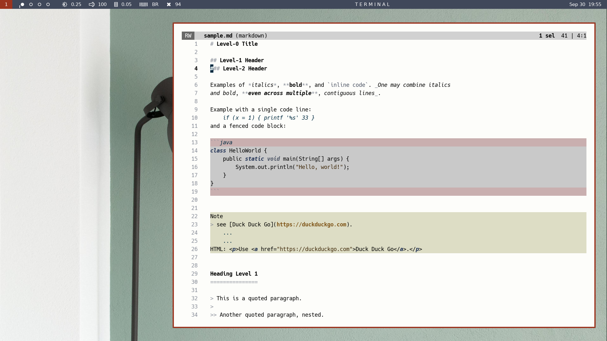

# shadow.kak

A plugin to colorize buffer regions in Kakoune.



The plugin works by identifying regex-delimited regions of the buffer,
splitting these regions by lines, and applying the Kakoune *line* highlighter
to all selected lines via *itersel*. Hooks on idle time refresh the
highlighting constantly.


# Installation

Copy `shadow.kak` somewhere in your autoload directory tree.


# Usage

Two commands are available to colorize portions of a buffer:

- `shadow-set`, a command to colorize buffer regions. These regions must be
delimited by an opening and a closing regex. Different colors are possible across
filetypes and within the same buffer.

- `shadow-decorate`, a command to customize the color of the first and/or last line
of a region. These lines must be identified by a regex. Different colors are possible
across filetypes and within the same buffer.


# Command Details

The first argument to `shadow-set` is the **filetype** (e.g., "ruby") you want to
colorize. The other arguments come by groups of six:

- **shadow_id**, your chosen name for a type of region (e.g., "codeblock")

- **opening_regex**, the regex for the first line of a colorized region

- **closing_regex**, the regex for the last line of a colorized region

- **first|nofirst**: whether to include ("first") or exclude ("nofirst") the first
line of a region. This is useful if you want your opening regex to include the line
that *precedes* (as a line delimiter) region start.  Alternatively, this can be used
to leave the first line free to be customized via `shadow-decorate`.

- **last|nolast**: whether to include (“last”) or exclude (“nolast”) the last
line of a region; this is useful if you want your closing regex to include the line
that *follows* (as a line delimiter) region end. Alternatively, this can be used
to leave the last line free to be customized via `shadow-decorate`.

- **face**, the face (i.e., foreground and background) you want for a region of
type *shadow_id*


The first argument to `shadow-decorate` is the **filetype** you want to colorize.
The other arguments come by groups of three:

- **decor_id**, your chosen name for a type of line (e.g., "codehead")

- **line_regex**, a regex for the lines to be customized

- **face**, the face (i.e., foreground and background) you want for a line of type *decor_id*


# Example

Region colorization in the screenshot above resulted from the following commands:

````
shadow-set markdown \
code ^\h*``` \n\h*``` nofirst nolast default,rgb:c9c9c9 \
note ^Note \n\n first nolast default,rgb:ddddc5

shadow-decorate markdown \
border ^\h*``` default,rgb:c9afaf
````

(Here, backslashes have been used to spread commands across successive lines and
facilitate understanding.)

The first line for `shadow-set` says that **markdown** is our target filetype.

The second line specifies colorization for buffer regions we call "code": after the
opening and closing regexes, we specify **nofirst** and **nolast** to exclude the
first and last lines of each region, as these will be colorized separately via
`shadow-decorate`. The next argument is our chosen face for the regions,
"default,rgb:c9c9c9" (a gray background).

The third line specifies colorization for buffer regions we call "note": after
the opening and closing regexes, we specify **first** to include the first line and
**nolast** to exclude the last line. We exclude the last line because our regex
for region ending, `\n\n`, comprises the empty line that *follows* each region.
The last argument is our chosen face for the regions, "default,rgb:ddddc5" (a
yellowish background).

The first line for `shadow-decorate` says that we will decorate lines for the
**markdown** filetype. The second line says that we will decorate lines called
"border", identified by the following regex, and colored as `default,rgb:c9afaf`
(a pinkish background).


# Note on regexes

The shadow plugin implements commands that surround regular expressions with single
quotes. Accordingly, the best way to include single quotes in a regex for `shadow.kak`
is to replace each of them by `\x27` (which specifies the single-quote character via
its hexadecimal codepoint).


## License

MIT

